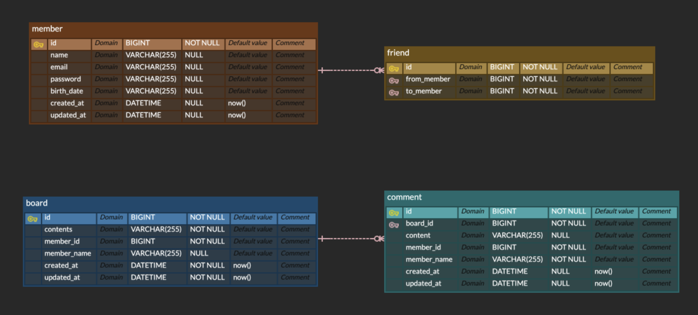

# CO-MU-NITY 
# 일정 관리 앱 2
## 기능목록
- 모든 테이블은 고유 식별자(ID)를 가진다
- `3 Layer Architecture` 에 따라 각 Layer의 목적에 맞게 개발
- CRUD 필수 기능은 모두 데이터베이스 연결 및 `JPA`를 사용해서 개발
- JPA 연관관계는 `양방향`으로 구현
- 인증/인가 절차는 `JWT`를 활용하여 개발.

### 멤버
- 멤버 저장(회원가입, 로그인), 조회(전체), 수정, 삭제

### 게시글

- 게시글 저장, 조회(전체, 선택), 수정, 삭제
- 기본 정렬은 생성일자 기준으로 내림차순 정렬
- 10개씩 페이지네이션하여, 각 페이지 당 뉴스피드 데이터가 10개씩 나옴

### 댓글
- 댓글 생성, 조회(전체), 수정, 삭제

### 팔로워
- 팔로워, 조회(전체), 삭제

## API 명세서
https://documenter.getpostman.com/view/38711511/2sAY4rF5ht

## ERD
